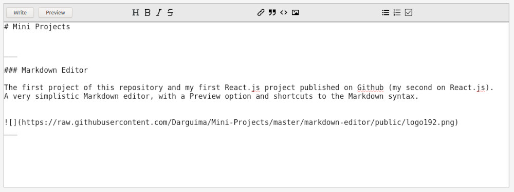
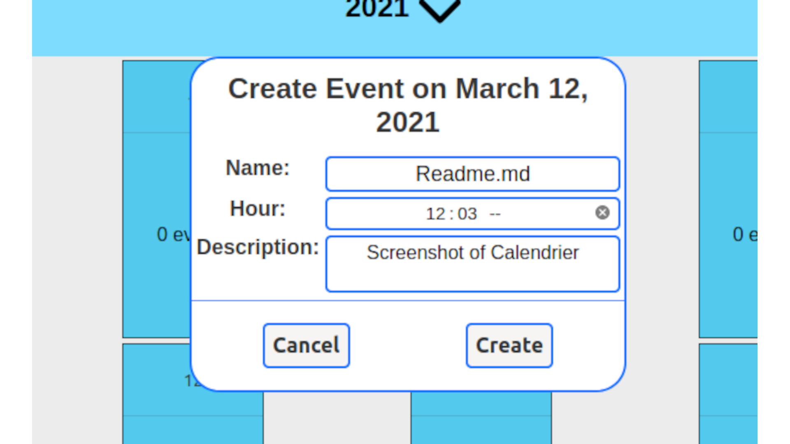

<h1 align="center">
	
</h1>

	
	

		Mini Projects is where I write my random study projects. Without any specific language, with incomplete projects and probably many bugs this is a repository to record the evolution of my knowledge about code.
	

 

## Projects

___

### Markdown Editor

The first project of this repository and my first React.js project published on Github (my second on React.js).

A very simplistic Markdown editor, with a Preview option and shortcuts to the Markdown syntax.

___

### Calendrier

My first "big" project written in React.js and Node.js. A simple calendar where you can log in to your account (or better log in to any account) and create your events to be accessed anywhere.

___

### Proffy

Proffy was created during the [Rocketseat](https://rocketseat.com.br/) event `New Level Week #1`.
Proffy is a platform to teachers and students communicate and sell/buy online school classes.

___

### Ecoleta

Ecoleta was created during the [Rocketseat](https://rocketseat.com.br/) event `New Level Week #2`.
Ecoleta is a platform for recycling companies to publicize their collection points and to let people know where to go when they want to recycle.

___

### Rocketpay

Rocketpay was created during the [Rocketseat](https://rocketseat.com.br/) event `New Level Week #4`.
Rocketpay an API for a e-Bank. Create an account, deposit or withdraw and transfer money with your friends.
___
