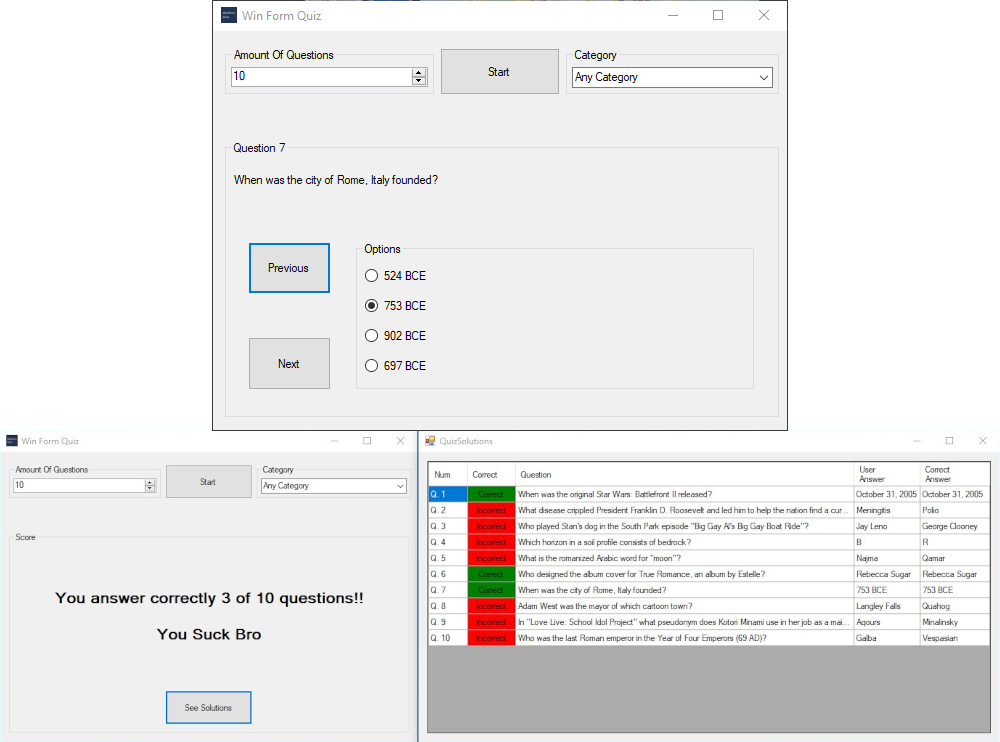

Win Form Quiz is another project created to study Windows Forms, a subject at my High School. It's a simple question game that consumes data from an API.

###### Technologies used: `C#` & `Windows Forms`

###### [Go to Project Repository  🖱️](https://github.com/Darguima/Win-Form-Quiz)

