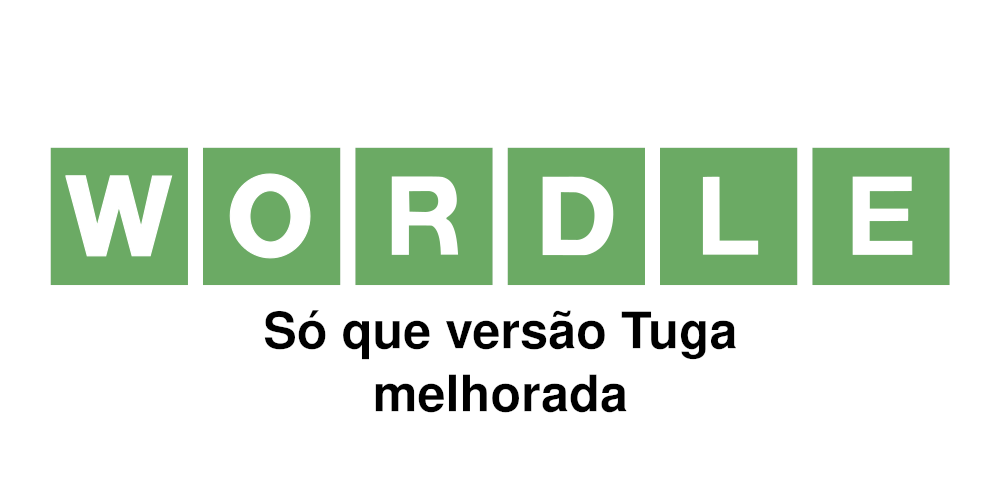
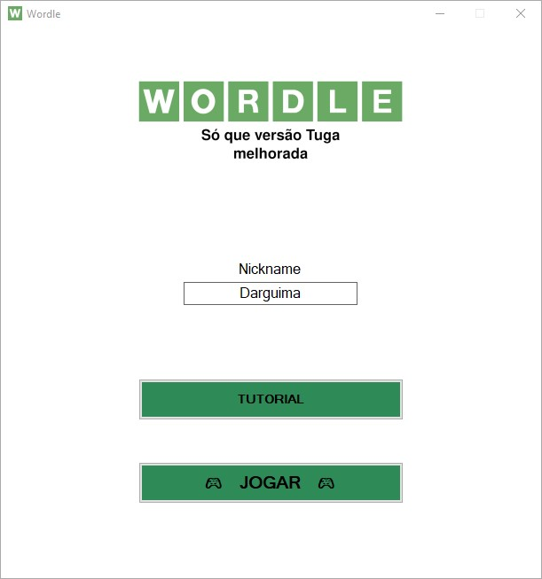
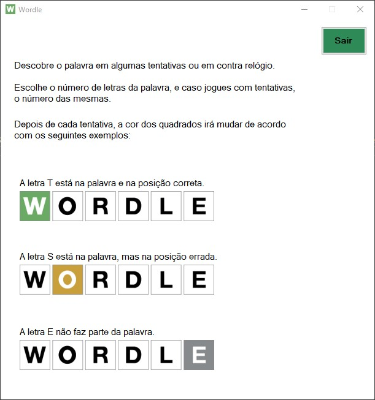
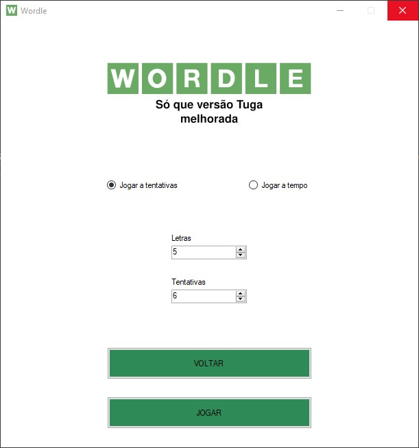
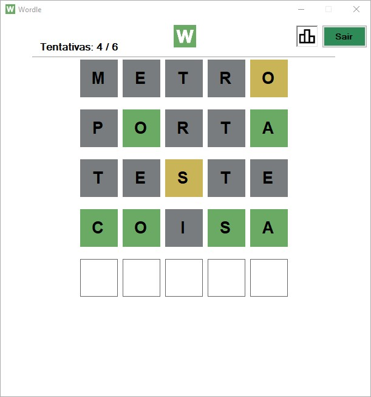
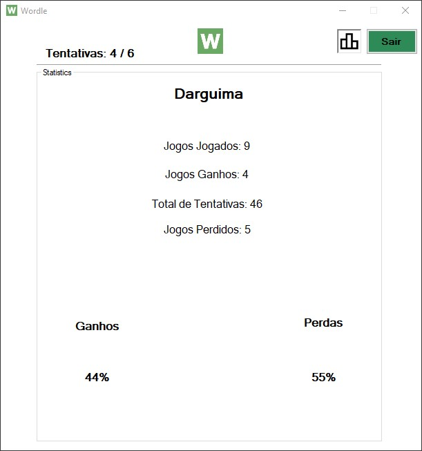
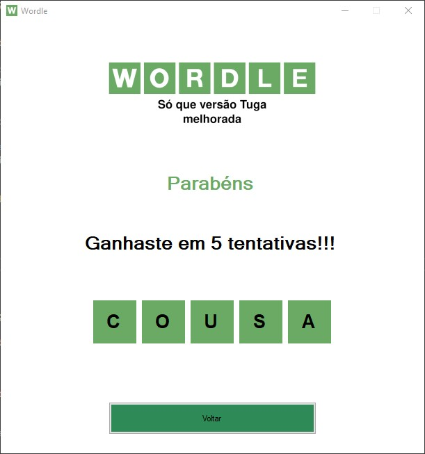

This game is the final project created to a subject at my High School. `Wordle Tuga` is a portuguese version of [`Wordle`](https://www.nytimes.com/games/wordle/index.html) game.

Download the game [here](https://github.com/Darguima/Wordle-WinForms/releases/tag/v1.0.0).

###### Technologies used: `C#` & `Windows Forms` & `Python`

###### [Go to Project Repository  🖱️](https://github.com/Darguima/Wordle-WinForms)

	
	
	
	
	
	

