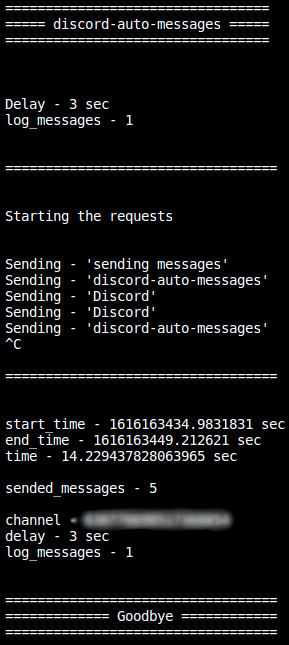

<h1 align="center">
	
</h1>

Discord Auto Messages is a simple python script that was created for a random reason on a Discord server. My friends and I started sending spam in the chat to get XP from the MEE6 bot. But I, who was not in the patience to be always there typing, decided to create a python script that would work for me.

###### Technologies used: `Python`

###### [Go to Project Repository  🖱️](https://github.com/Darguima/discord-auto-messages)

