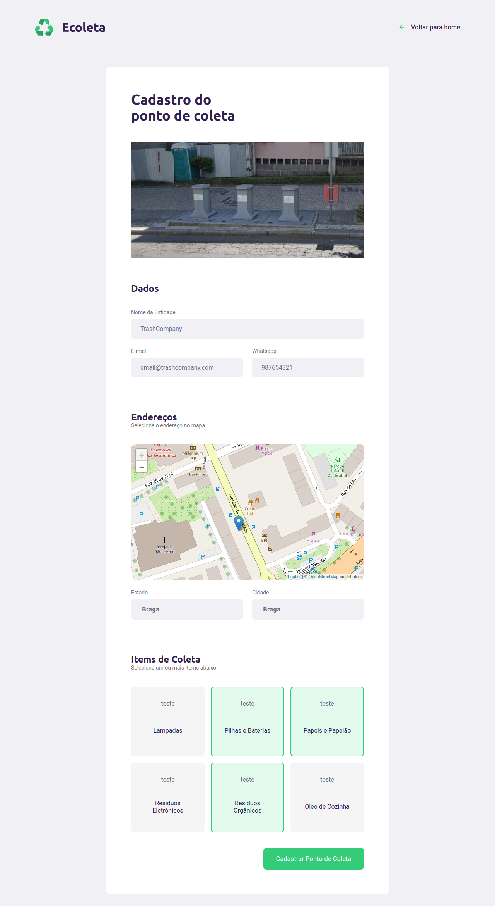
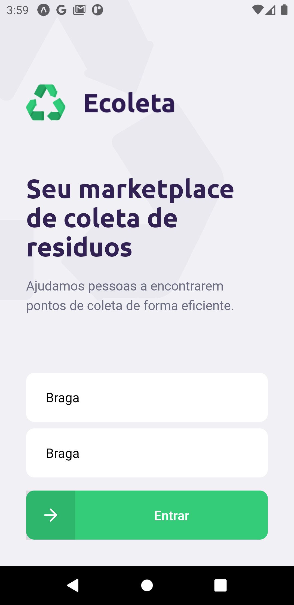
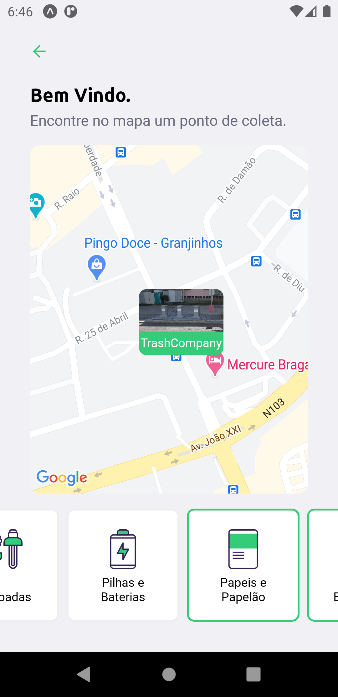

<h1 align="center">
	
</h1>

Ecoleta was created during the [Rocketseat](https://rocketseat.com.br/) event `New Level Week #2`.
Ecoleta is a platform for recycling companies to publicize their collection points and to let people know where to go when they want to recycle.

	
	

	
	
	

## Setup the Server

1. npm install

2. npm run-script knex:migrate

3. npm run-script knex:seed

4. Correct the IP address on `server/src/controllers/pointsController.ts` x 2 and `server/src/controllers/itemsController.ts`

5. npm run-script dev

## Setup the Web and Mobile

1. Correct the IP address on `${mobile or web}/src/services/api.tsx`
