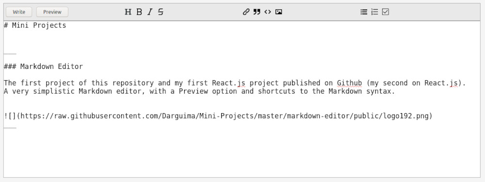
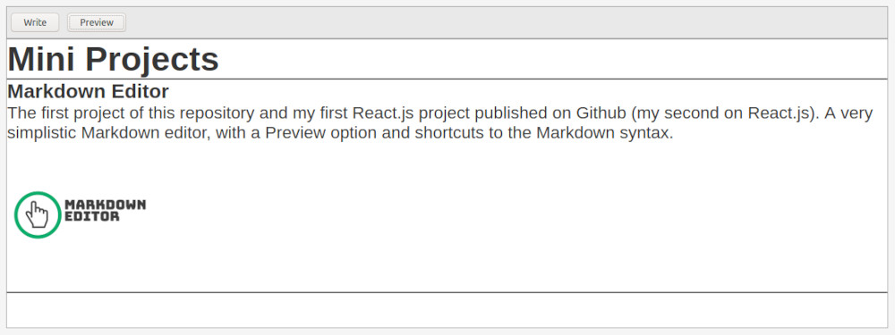

<h1 align="center">
	
</h1>

The first project of this repository and my first React.js project published on Github (my second on React.js).

A very simplistic Markdown editor, with a Preview option and shortcuts to the Markdown syntax.

	
	

## Set up

> npm install

> npm start
